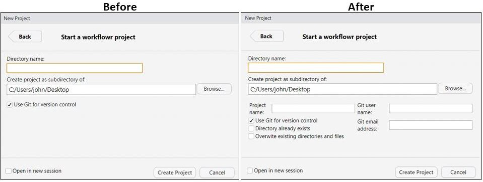

[adam-austin]: http://twitter.com/just_add_data
[angela-li]: https://twitter.com/CivicAngela
[anh-tran]: http://twitter.com/anh_n_tran
[anna-vasylytsya]: https://github.com/annnvv
[brooke-anderson]: http://twitter.com/gbwanderson
[edward-visel]: http://twitter.com/alistaire
[chircollab]: https://chircollab.github.io/
[chirunconf]: https://chirunconf.github.io/
[datos]: https://github.com/chircollab/chircollab20/issues/35
[emily-riederer]: http://twitter.com/EmilyRiederer
[eric-nantz]: http://twitter.com/theRcast
[gabi-cipriano]: https://github.com/gcipriano
[git-for-science]: https://github.com/jdblischak/git-for-science
[git-for-science-plos]: https://doi.org/10.1371/journal.pcbi.1004668
[github-suggest]: https://help.github.com/en/github/collaborating-with-issues-and-pull-requests/incorporating-feedback-in-your-pull-request#applying-a-suggested-change
[googlecivic]: https://github.com/willdebras/googlecivic/
[httr-retry]: https://github.com/chircollab/chircollab20/issues/1
[issues]: https://github.com/chircollab/chircollab20/issues
[james-lamb]: http://twitter.com/_jameslamb
[jim-gruman]: https://twitter.com/jim_gruman
[jim-gruman-post]: https://jimgruman.netlify.app/post/chicago-r-collaborative-2020/
[jonathan-keane]: https://github.com/jonkeane
[kableExtra]: https://github.com/sharlagelfand/kableExtra-cookbook
[mauro-lepore]: http://twitter.com/mauro_lepore
[natalia-block]: http://twitter.com/nataliamblock
[natalia-block-post]: https://nataliablock.rbind.io/post/chircollab2020/
[rcollab-git]: https://github.com/maurolepore/rcollab-git
[refined-github]: https://github.com/sindresorhus/refined-github
[rstudio-project-template]: https://rstudio.github.io/rstudio-extensions/rstudio_project_templates.html
[sharla-gelfand]: http://twitter.com/sharlagelfand
[stefany-samp]: https://twitter.com/girasolechi
[sydney-purdue]: http://twitter.com/Sydney_NotAUS
[takehomecarpentries]: https://github.com/gcipriano/takehomecarpentries
[tomas-okal]: http://twitter.com/tomasokal
[tweets]: https://twitter.com/search?q=(%23chircollab)
[will-bonnell]: http://twitter.com/_willdebras
[workflowr]: https://github.com/jdblischak/workflowr
[workflowr-1.6.2]: https://github.com/jdblischak/workflowr/releases/tag/v1.6.2
[workflowr-cran]: https://cran.r-project.org/package=workflowr
[workflowr-issue-193]: https://github.com/jdblischak/workflowr/issues/193
[workflowr-issue-194]: https://github.com/jdblischak/workflowr/issues/194
[workflowr-pr-199]: https://github.com/jdblischak/workflowr/pull/199
[workflowr-pr-200]: https://github.com/jdblischak/workflowr/pull/200
[workflowr-pr-201]: https://github.com/jdblischak/workflowr/pull/201
[workflowr-pr-202]: https://github.com/jdblischak/workflowr/pull/202
[workflowr-pr-205]: https://github.com/jdblischak/workflowr/pull/205

One of my favorite parts of R is the community, so I was excited for this year's
[Chicago R Collaborative][chircollab] (rebranded from last year's [Chicago R
Unconference][chirunconf]). I was disappointed that the in-person event
scheduled for March had to be canceled, but fortunately the amazing organizers
([Angela Li][angela-li], [Emily Riederer][emily-riederer], [Sydney
Purdue][sydney-purdue], [Will Bonnell][will-bonnell]) were able to quickly pivot
to hosting a virtual event last April.

As a mentor for the event, my main goal was to empower R users to become R
developers by contributing to open source R projects. I did this via live
tutorials demonstrating how to use Git and GitHub, and mentoring contributions
to my R package [workflowr][].

## Collaborating with Git and GitHub

A big hurdle for new contributors is learning the technical and social skills to
contribute via Git and GitHub. To help with this, I teamed up with [Mauro
Lepore][mauro-lepore] to do a live demonstration of contributing to an open
source project on GitHub. Mauro created a new Git repository, I made a
contribution, and he merged my Pull Request. We didn't record the actual demo so
that attendees wouldn't be self-conscious about asking questions. However, you
can watch the practice demo we recorded prior to the event:

<iframe width="560" height="315" src="https://www.youtube-nocookie.com/embed/y8lOGz1yAj4" frameborder="0" allow="accelerometer; autoplay; encrypted-media; gyroscope; picture-in-picture" allowfullscreen></iframe>

After our demo, we had the attendees create their own Pull Requests to this new
repository. They submitted R-related tips and tricks. Check out the repository
[rcollab-git][] to read their advice. We had 4 attendees successfully submit a
Pull Request: [Jim Gruman][jim-gruman], [Eric Nantz][eric-nantz], [Anna
Vasylytsya][anna-vasylytsya], and [Stefany Samp][stefany-samp].

If you're interested in practicing submitting a Pull Request on GitHub, check
out the tutorial I co-authored, [A Quick Introduction to Version Control with
Git and GitHub][git-for-science-plos]. It explains how to submit a Pull Request
to the accompanying repository [git-for-science][].

The second live demo I did was an impromptu idea from [Anna
Vasylytsya][anna-vasylytsya]. [James Lamb][james-lamb] had submitted a [Pull
Request to my workflowr package][workflowr-pr-199], and Anna suggested that I do
the code review live so that others could see what this process was like. This
was a great learning experience, especially for me!

I reviewed the Pull Request and submitted a [GitHub
review](https://help.github.com/en/github/collaborating-with-issues-and-pull-requests/about-pull-request-reviews).
I explained that one of the reasons I liked using the GitHub review instead of
leaving individual comments was so that the person that submitted the Pull
Request would receive one notification instead of individual notifications for
each comment (I've been on the other end of this, and it can be demoralizing,
because the reviewer often starts with the requested changes, and doesn't add
the positive feedback until the end). James added his strategy for leaving
reviews, which I thought was a great summary of a social practice that I had
adopted but didn't realize: If you are responsible for the all of the code that
the Pull Request affects, you should leave a review to approve or request
changes. On the other hand, if you just want to lend your expertise on one
aspect of the Pull Request, leave single comments without giving a review.

I also learned more from James about the [GitHub feature to suggest changes on a
Pull Request][github-suggest]. I knew that GitHub had made it possible to
suggest edits directly in the source code, but I didn't realize that the
submitter of the Pull Request can accept and convert the suggested edit into a
commit without having to leave the GitHub user interface. Very slick.

After having done these two live demos, I realized too late that some aspects of
my GitHub user interface may have looked different than the standard because I
have the browser extension [refined-github][] installed. In retrospect I should
have disabled it for the demos to remove any unnecessary distractions. However,
on the plus side it did give me the opportunity to share this GitHub tip. If you
spend a lot of time working on GitHub, I recommend giving it a try (especially
if you use a lot of CI services). The extension is available for Firefox and
Chrome.

## Contributions to workflowr

I was very happy to have 3 new collaborators contribute to my R package
[workflowr][]. Their contributions described below are already available in the
[latest CRAN release][workflowr-cran] ([version 1.6.2][workflowr-1.6.2]).

[Anh Tran][anh-tran] overhauled workflowr's [RStudio project
template][rstudio-project-template] ([workflowr Issue #193][workflowr-issue-193]). The existing version I had created was very
minimal, and only exposed a few of the arguments to `wflow_start()`. Anh created
a wrapper function to handle additional arguments passed from RStudio and
updated the user interface ([PR #200][workflowr-pr-200]). Furthermore, he
created unit tests for the new wrapper function! ([PR #205][workflowr-pr-205])

[Sydney Purdue][sydney-purdue] added some extra error handling to
`wflow_start()` to fail early when the input argument `overwrite` is used
incorrectly ([workflowr Issue #194][workflowr-issue-194]). And she wrote her
first unit test! ([PR #202][workflowr-pr-202])

[James Lamb][james-lamb] updated the HTTP calls to the GitHub API in
`wflow_use_github()` to be more resilient to transient network issues by using
`httr::RETRY()`, which automatically retries HTTP calls more than once
([PR #199][workflowr-pr-199], [PR #201][workflowr-pr-201]).

## Links to other chircollab 2020 projects and posts

**Projects:**

* [kableExtra cookbook][kableExtra] -
[Sharla Gelfand][sharla-gelfand], [Brooke Anderson][brooke-anderson],
and [Jim Gruman][jim-gruman]

* [googlecivic][] -
[Will Bonnell][will-bonnell], [Edward Visel][edward-visel],
and [Natalia Block][natalia-block]

* [`httr::RETRY()`][httr-retry] -
[James Lamb][james-lamb], [Anna Vasylytsya][anna-vasylytsya],
[Adam Austin][adam-austin], and [Tomas Okal][tomas-okal]

* [datos][] -
[Mauro Lepore][mauro-lepore] and [Jonathan Keane][jonathan-keane]

* [takehomecarpentries][] - [Gabi Cipriano][gabi-cipriano]

* [All proposed projects][issues]

**Blog posts:**

* [Natalia Block][natalia-block] - [R Collaborative Conference: tips to make the most of it][natalia-block-post]

* [Jim Gruman][jim-gruman] -
[Chicago R Collaborative 2020][jim-gruman-post]

**Tweets:** [#chircollab][tweets]
