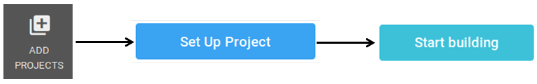

I really enjoy Continuous Integration (CI) testing. The immediate feedback is
super useful, especially when you need to test your code across multiple
different setups (e.g. different operating systems or versions of dependencies).
The rise of free CI services has hugely impacted my workflow, similar to when I
started using Git and GitHub.

If you haven't started using CI to automatically test your R package(s), you
should go run `usethis::use_appveyor()` and `usethis::use_travis()`. These will
setup Windows testing on AppVeyor and Linux testing on Travis CI, respectively.
Since AppVeyor and Travis CI are the best supported CI platforms for R packages,
they are definitely where you should start.

However, if you've already started using CI services, I want to encourage you to
try CircleCI. I recently started using it to test an R package and various
analysis projects, and it has a nice feature set that can make it more
convenient to customize compared to either AppVeyor or Travis.

## Why try CircleCI?

CircleCI has various features that I have found useful:

1. **Specify any Docker image on DockerHub for the computational environment.**
This makes local debugging much easier. If it works in a local Docker container,
you know it'll also work on CirlceCI's servers. I'm too often surprised by the
errors I get from AppVeyor or Travis that I don't get on my local machines. Note
that while you can [use Docker with Travis][travis-docker], it's more
cumbersome (you have to prefix all your commands with `docker run` or similar).

1. **Easy to upload artifacts.** Similar to AppVeyor, it is very easy to specify
individual files or entire directories to upload as artifacts. This makes it
very convenient to find the error in a log file or inspect the result of the CI
build. This is much easier to configure compared to Travis, which [requires you
to setup an AWS instance to upload artifacts][travis-artifacts].

1. **Long run time.** Travis builds time out after 50 minutes. AppVeyor builds
time out after 1 hour. I have had CircleCI jobs successfully complete after
running for over 2 hours. The [offical pricing information][circleci-price]
states that the free plan provides 1,000 build minutes for free, but this only
applies to private projects. There is [no monthly limit on build minutes for
open source projects][circleci-open-source].

1. **Straight-forward to setup SSH keys.** For my analysis projects, I often
want to be able to commit some result back to my GitHub repository. A common
technique for authenticating the CI server to push a commit to one of your Git
repositories is to use an SSH deploy key. The basic idea is that you upload a
public key to the repository, and then you upload the encrypted private key to
the CI server. This way if the private key were to be compromised, an attacker
would only have access to one repository. I found the [Travis instructions for
setting up a deploy key][travis-deploy-key] to be confusing and unnecessarily
tedious (from what I can tell, you have to specify the key by committing an
encrypted file to the repository). This is likely because they recommended you
use [other deployment strategies][travis-deploy]. In contrast, I found the
[CircleCI instructions and steps][circleci-deploy-key] much more
straight-forward to follow.

[circleci-deploy-key]: https://circleci.com/docs/2.0/add-ssh-key/
[circleci-open-source]: https://circleci.com/blog/building-open-source-projects-on-circleci/
[circleci-price]: https://circleci.com/pricing/
[travis-artifacts]: https://docs.travis-ci.com/user/uploading-artifacts/
[travis-deploy]: https://docs.travis-ci.com/user/private-dependencies/
[travis-deploy-key]: https://docs.travis-ci.com/user/private-dependencies/#deploy-key
[travis-docker]: https://docs.travis-ci.com/user/docker/

## Minimal setup to check an R package

Now I'll demonstrate how to configure a minimal setup to check an R package on
CircleCI. In a future post, I'll detail some options for customization. The
first decision is which Docker image to use. Fortunately for R users, the
[rocker][] project provides many Docker images customized for running R. I've
chosen the image [verse](https://hub.docker.com/r/rocker/verse/tags) because it
contains everything you'll likely need for checking your package, specifically
devtools for installing dependencies and texlive/pandoc for building
documentation. I also use the tag `3.5.3` to always use the image with R 3.5.3
installed, the latest relase when this post was published.

Next we need to know what commands to run to build and check the R package. For
this I copied the [main steps from the Travis CI R
setup](https://docs.travis-ci.com/user/languages/r#customizing-the-travis-build-steps):

```
# Install package dependencies
R -e "devtools::install_deps(dep = TRUE)"
# Build package
R CMD build .
# Check package
R CMD check *tar.gz
```

To instruct CircleCI to run these commands inside the specified Docker image, we
need to translate this to the [CircleCI YAML configuration file](). Below is a
basic template. We specify the Docker image to pull from DockerHub and then
specify the steps to run. The first is the keyword `checkout`, which essentially
runs `git clone`. Then for each custom step, we use the key word `run` and
specify a `name` and `command`.


```
version: 2
jobs:
  build:
    docker:
      - image: <DockerHub image>
    steps:
      - checkout
      - run:
          name: <description of this step>
          command: <code to run>
```

Thus our minimal setup to build and check an R package looks like this:

```
version: 2
jobs:
  build:
    docker:
      - image: rocker/verse:3.5.3
    steps:
      - checkout
      - run:
          name: Install package dependencies
          command: R -e "devtools::install_deps(dep = TRUE)"
      - run:
          name: Build package
          command: R CMD build .
      - run:
          name: Check package
          command: R CMD check *tar.gz
```

Which we save in `.circleci/config.yml`. Note that you will also need to ignore
this directory when building your R package. You can automatically add it to
your `.Rbuildignore` with `usethis::use_build_ignore(".circleci")`. Next, commit
the new files and push to the remote repository.

```
git add .circleci/ .Rbuildignore
git commit -m "Configure CircleCI"
git push origin master
```

Go to [](https://circleci.com/) and login with your GitHub or Bitbucket
credentials. Click on "Add Projects" in the left sidebar. Find your repository
in the list and click "Set Up Project". This will present you with a ton of
options. You can ignore all these since you've already committed
`.circleci/config.yml`. Scroll to the bottom and click "Start Building". Note
that you'll receive an email notification stating that a new SSH deploy key has
been added to your repository.



Now your build should start. It will perform each step in sequence, and you can
click on any of the steps to see its log. Once it finishes, it should look like
below:


And now this build will be triggered each time you push a new commit!

One last thing for the minimal setup. You can upload the entire results
directory by adding the following two lines after the build steps, including the
name of your package in the filepath.

```
      - store_artifacts:
          path: <insert-name-of-pkg>.Rcheck/
```

After you commit and push this change to `.circleci/config.yml`, there will be a
new step named "Uploading artifacts". Once this step has completed, you can
click on the tab named "Artifacts" to view any of the files, e.g. `00check.log`.

## CircleCI limitations

Every CI platform I have used has had its advantages and disadvantages. I hope
I've convinced you that CircleCI is worth trying, but I also want to highlight
some of its limitations.

First, it is not possible to link to a specific line in the build logs. This is
really unfortunate, especially when build logs get really long (e.g. lots of
package dependencies with compiled code). When using Travis and AppVeyor, I
often link to the exact line that contains the relevant error message when
creating a GitHub Issue or asking someone else to help troubleshoot.

Second, pull requests send by other users are not built automatically. This is
really unfortunate since one the main advantages of using CI is that it helps
you evaluate code that others contribute to your project. To activate this
important feature, you have to manually go to Settings -> Advanced Settings and
turn on "Build forked pull requests".

## Future posts

There is a lot more you can do with CircleCI. In future posts, I'll address
[dependency caching][circleci-caching], adding an [SSH deploy
key][circleci-ssh-key], and testing an analysis project. To learn more about
testing R packages on CircleCI, I highly recommend this [post][appsilon] by
Marek Rogal on the Appsilon blog.
 
[appsilon]: https://appsilon.com/continuous-integration-for-your-private-r-projects-with-circleci/
[circleci-caching]: https://circleci.com/docs/2.0/caching/
[circleci-ssh-key]: https://circleci.com/docs/2.0/add-ssh-key/
