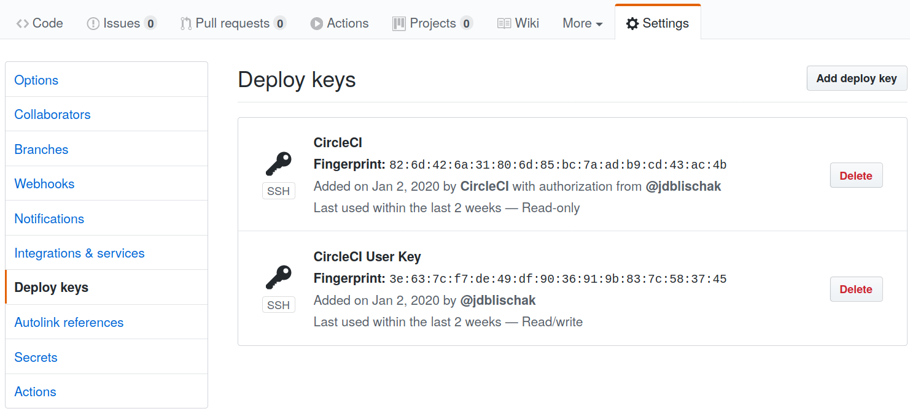
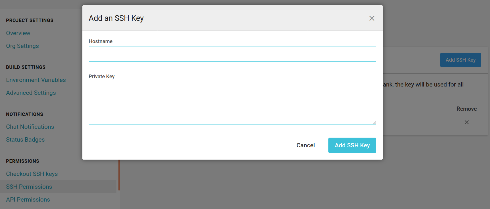

Continuous integration (CI) is traditionally used for testing software and also
optionally deploying the code to be executed on a different server. However, I
sometimes want to be able to have the CI job commit changes back to the Git
repository that initially triggered the CI build. For example, if I have
automated a data analysis, I want the latest version of the report to be
committed back the repository. Another example is committing the latest version
of the documentation (e.g. to the gh-pages branch of a GitHub repository).

As I mentioned in my [first post on using CircleCI][circleci-for-r-1], I have
found that configuring CircleCI to commit back to a Git repository to be easier
compared to other CI platforms. Below I detail the steps required.

## Initial setup

This post assumes you already have already done the following:

1. Created a GitHub repository
1. Activated CI builds for the repository on CircleCI

If you haven't done this, see the CircleCI documentation [Getting
Started][circleci-start].

## Overview and terminology

The overall goal is to automatically save some artifact generated by a CI job
(e.g. report, plot, documentation).^[Version control purists will object to
saving generated content in a version control repository. And sure, if you are a
part of a team working on a large enterprise codebase, you would be wise to save
generated content on a separate server for sharing with others. But for
individuals or small teams with fewer resources, saving generated content in the
original Git repository is a practical choice with plenty of benefits: keep
everything in one place, serve HTML files with GitHub Pages, record history of
changes, etc.] To accomplish this, the main challenge is authenticating the CI
server to be able to commit to your repository on your behalf.

There are various options for authentication. One would be to use a Personal
Access Token (PAT), either for your own account or a bot account. However, I
dislike this option because it is not possible to limit the scope of a PAT to a
single repository. In other words, if a PAT with write permissions is exposed,
it gives write access to every repository owned by that account. Thus a
preferred option is to use SSH keys for authentication.^[This assumes you will
follow my directions below to create one-off keys only to be used for this task.
If you were to use the keys that you use to authenticate with GitHub, e.g. when
you run `git push`, this would of course give an attacker access to all of your
GitHub repositories.]

Frustratingly, the documentation can get confusing because GitHub and CircleCI
use different terminology when discussing SSH keys. For me it was helpful to
always think in terms of "read" versus "write" access.

When you activate CircleCI to build a GitHub repository, it automatically adds a
key to the GitHub repository. In fact, you probably received an email from
GitHub with the title "A new public key was added to
&lt;account&gt;/&lt;repository&gt;" alerting you to the fact that this happened.
You can navigate to view the key on GitHub by going to Settings -> Deploy Keys.
Note that this key is named "CircleCI", and that it is "Read-only". This means
that CircleCI currently only has permission to read from the repository. If you
add a `git push` to your CI job, it will fail with an authentication error. In
the CircleCI documentation, they refer to this key as a "deploy key", which is
confusing since GitHub labels all repository-specific keys as "deploy keys".

Thus you need to generate a key that has write access and register it with
GitHub. CircleCI refers to such a key as a "user key". While you could use the
SSH key associated with your GitHub user account (assuming you have one), I
strongly advise against this. This would be even worse than using a PAT, because
at least a PAT can be limited to certain scopes (e.g. only public repositories).
If your user SSH key is exposed, an attacker would have access to all of your
public and private repositories. Instead, below I'll show you how to create a
one-off SSH key that you will only use with one repository.

The table below summarizes the terminology used by GitHub and CircleCI for
various types of SSH keys.

Permissions | GitHub     | CircleCI
----------- | ---------- | ----------
Read        | Read-only  | Deploy key
Read, Write | Read/write | User key

## Generate one-off SSH keys

First you need to create some one-off SSH keys that will only be used by
CircleCI to authenticate with this one GitHub repository. You can follow the
standard instructions from GitHub for [generating a new SSH
key][github-ssh-key]. However, there is one main difference. You will
immediately delete the key from your local computer afterwards, thus you want to
make sure you don't break your current setup. If you already have SSH keys on
your machine, they are likely in the default location: `~/.ssh/`. You can use
the flag `-f` to specify the location of the output key files. Run the commands
below to generate new SSH keys.^[The comment passed to `-C` can be whatever you
like. It's purpose is to remind you what the key is for.] When asked for a
passphrase, press enter twice to not add a passphrase to the key.

```
mkdir /tmp/ssh-temp/
ssh-keygen -t rsa -b 4096 -C "CircleCI User Key" -f /tmp/ssh-temp/key
```

This created the private key `/tmp/ssh-temp/key` and the public key
`/tmp/ssh-temp/key.pub`.

## Add the public key to GitHub

Next navigate to your repository on GitHub. Click on Settings and then select
"Deploy keys" from the menu on the left. You should see that there is already a
"Read-only" key named "CircleCI". Click "Add deploy key". You can name it
whatever you like. I use "CircleCI User Key" to be consistent with the CircleCI
documentation. Then copy-paste the contents of the public key
`/tmp/ssh-temp/key.pub` into the Key field. Lastly, check the box "Allow write
access" so that CircleCI can push back to GitHub.



## Add the private key to CircleCI

Next navigate to the project on CircleCI. The URL follows the pattern:
`https://circleci.com/gh/<account>/<repo>`.^[For convenience, I recommend the
Firefox addon [Open CircleCI
Workflows](https://addons.mozilla.org/en-US/firefox/addon/open-circleci-workflows/).
Whenever you have a GitHub repository open in your browser, it inserts a button
with the CircleCI logo into the address bar. Clicking on this button takes you
directly to the project on CircleCI.]

Don't click on the "Settings" in the menu on the left. That is for user
settings. Instead, click on the gear icon in the top right. Then choose "SSH
Permissions" and "Add SSH key". You can put whatever you like in the Hostname
field to remind you that this key is for pushing to GitHub. Copy-paste the
private key in `/tmp/ssh-temp/key` into the field "Private Key". As the name
implies, it is really important that you do not expose this key.



## Add the fingerprint to configuration file

After adding the private key to CircleCI, you will see it displays a fingerprint
for the key. You will need to add this key to the configuration file
`.circleci/config.yml` in your repository using the step `add_ssh_keys`.
Copy-paste the fingerprint into an `add_ssh_keys` step as shown below:

```
    steps:
      - checkout
      - add_ssh_keys:
          fingerprints:
            - "<copy-paste-fingerprint-here>"
      - run:
```

## Push to GitHub

Now that CircleCI has permission to push to GitHub, you'll need to add a step to
do this. It can look something like below. It configures Git, commits any
changes to all tracked files, and then pushes to GitHub. The `--allow-empty`
prevents an error in the case where no files were changed. The `[skip ci]`
prevents the job from running in an infinite loop due to constantly
re-triggering the CI build.

```
      - run:
          name: Commit to GitHub
          command: |
            git config user.email "<insert-the-email-you-use-with-github>"
            git config user.name "CircleCI Job"
            git commit --allow-empty -am "Automatic commit from CircleCI [skip ci]"
            git push origin master
```

Now you probably don't want to always attempt to push to GitHub. For example,
when CI builds are triggered by a Pull Request. The updated version below
requires a specific CircleCI user account and that it is not a Pull Request.
Otherwise it doesn't attempt to commit.

```
      - run:
          name: Commit to GitHub
          command: |
            if [[ "${CIRCLE_USERNAME}" = "<account>" && -z "${CIRCLE_PULL_REQUEST}"]]
            then
              echo "Committing to GitHub"
              git config user.email "<insert-the-email-you-use-with-github>"
              git config user.name "CircleCI Job"
              git commit --allow-empty -am "Automatic commit from CircleCI [skip ci]"
              git push origin master
            else
              echo "Not committing to GitHub"
            fi
```

Commit this update to the local configuration file and then push to GitHub. This
time the build should result in a new commit to the repository.

## Delete the local SSH key files

Once you've confirmed everything is working as expected, delete the one-off SSH
keys from your local machine:

```
rm -r /tmp/ssh-temp/
```

## Conclusion

Now any time you want CircleCI to automatically update the results of an
analysis or documentation files for a GitHub repository, you can follow these
steps to setup the authentication.

Lastly, I'll note that a powerful combination is to [schedule the
workflow][circleci-schedule] to be run on CircleCI at regular intervals. Then
the repository will stay up-to-date without requiring any intervention.

[circleci-schedule]: https://circleci.com/docs/2.0/workflows/#scheduling-a-workflow

## Links to further documentation

* GitHub
    * [Generating a new SSH key][github-ssh-key]
* CircleCI
    * [Adding an SSH Key to CircleCI][circleci-add-ssh]
    * [GitHub and Bitbucket Integration][circleci-github]
        * [Deployment Keys and User Keys][circleci-deploy-keys]
    * [Deploying documentation to GitHub Pages with continuous integration][circleci-gh-pages]
* My previous posts on CircleCI
    * [CircleCI for R: Motivation and basic setup][circleci-for-r-1]
    * [CircleCI for R: Workflows, caches, and more][circleci-for-r-2]

[circleci-add-ssh]: https://circleci.com/docs/2.0/add-ssh-key/
[circleci-deploy-keys]: https://circleci.com/docs/2.0/gh-bb-integration/#deployment-keys-and-user-keys
[circleci-for-r-1]: ../circleci-for-r-1/
[circleci-for-r-2]: ../circleci-for-r-2/
[circleci-gh-pages]: https://circleci.com/blog/deploying-documentation-to-github-pages-with-continuous-integration/
[circleci-github]: https://circleci.com/docs/2.0/gh-bb-integration/
[circleci-start]: https://circleci.com/docs/2.0/getting-started/
[github-ssh-key]: https://help.github.com/en/github/authenticating-to-github/generating-a-new-ssh-key-and-adding-it-to-the-ssh-agent
