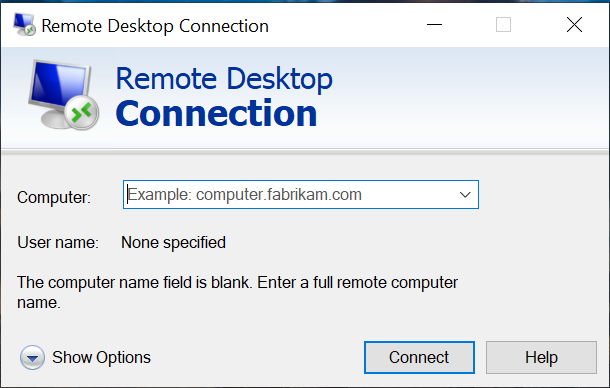
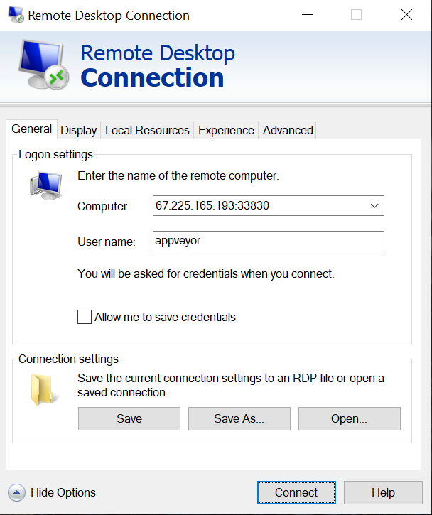
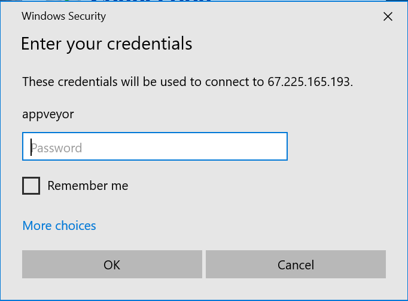
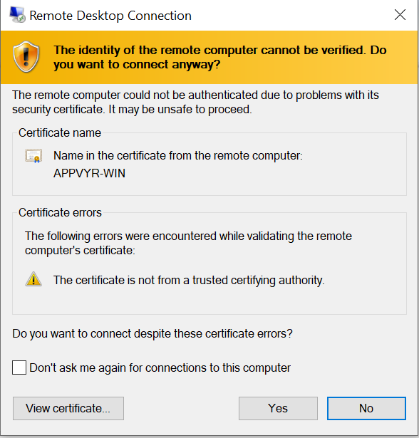
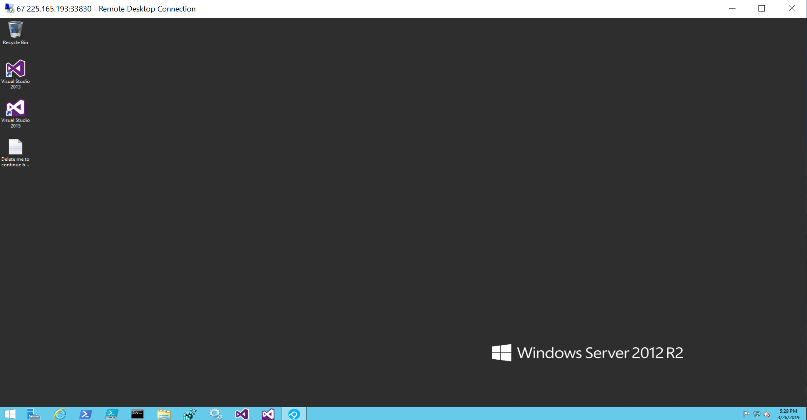
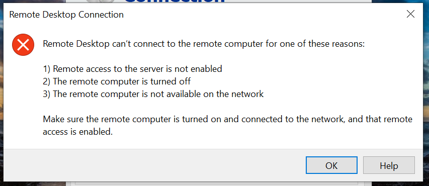

```{css}
d-article > p > img {
  width: 50%;
  display: block;
  margin: auto;
}
```

The continuous integration service [AppVeyor][] is great for regularly testing
your software on Windows, and it is well-supported for R package developers via
the [r-appveyor][] project. Run `usethis::use_appveyor()` to add Windows testing
to your R package.

Even though I have access to a local Windows machine, there have still been
times when I couldn't replicate an AppVeyor error. The cause of
hard-to-replicate bugs could be due to differences in the installed software
versions (e.g. pandoc, which was the source of my most recent AppVeyor bug) or
differences between the desktop and server versions of Windows. The good news is
that it is possible to [interactively debug][docs-appveyor] an AppVeyor build
using [Remote Desktop][rd]^[I'll refer to this software as Remote Desktop
throughout this post. It used to be called [Remote Desktop Protocol][rdp], so
the AppVeyor documentation refers to it as RDP. However, Microsoft now calls it
Remote Desktop Connection.] In this post, I provide step-by-step instructions on
how to setup and debug your R package build on AppVeyor using Remote Desktop.

[appveyor]: https://www.appveyor.com/
[docs-appveyor]: https://www.appveyor.com/docs/how-to/rdp-to-build-worker/
[r-appveyor]: https://github.com/krlmlr/r-appveyor
[rd]: https://en.wikipedia.org/wiki/Remote_Desktop_Services#Remote_Desktop_Connection
[rdp]: https://en.wikipedia.org/wiki/Remote_Desktop_Protocol

## Install Remote Desktop

**Windows:** If you are using a Windows machine, you already have Remote Desktop
installed. You can either type "Remote Desktop" into the search bar or navigate
to Programs -> Windows Accessories -> Remote Desktop Connection.

**macOS:**  Follow the instructions in [Get started with Remote Desktop on
Mac][ms-docs-rd-mac] to install [Microsoft Remote Desktop 10][rd-mac] from the
Mac App Store. Note that this requires macOS 10.11 or later.

[ms-docs-rd-mac]: https://docs.microsoft.com/en-us/windows-server/remote/remote-desktop-services/clients/remote-desktop-mac
[rd-mac]: https://itunes.apple.com/us/app/microsoft-remote-desktop/id1295203466?mt=12

**Linux:** Use your distribution's package manager to install [xrdp][], an open
source implementation of Remote Desktop. For example, on Debian/Ubuntu, run `apt
install xrdp`.

[xrdp]: http://www.xrdp.org/

<aside>
I've only ever tested this on Windows. If you configure Remote Desktop on macOS
or Linux and have tips to share, please open an [Issue][issue-new] and I'll
update the post.

[issue-new]: https://github.com/jdblischak/blog.jdblischak.com/issues/new
</aside>

## Configure to debug on failure

To have AppVeyor open a connection for you to login and debug your build, add
the following line to the `on_failure` section of `appveyor.yml`:

```
ps: $blockRdp = $true; iex ((new-object net.webclient).DownloadString('https://raw.githubusercontent.com/appveyor/ci/master/scripts/enable-rdp.ps1'))
```

If there is any error during the installation or checking of your R package,
this line tells AppVeyor to pause the build and print the server details for you
to connect and debug. If you're using the default [r-appveyor][] setup, your
`on_failure` step will look like the following:

```
on_failure:
  - 7z a failure.zip *.Rcheck\*
  - appveyor PushArtifact failure.zip
  - ps: $blockRdp = $true; iex ((new-object net.webclient).DownloadString('https://raw.githubusercontent.com/appveyor/ci/master/scripts/enable-rdp.ps1'))
```

These commands zip the `*.Rcheck/` directory, upload it as a build artifact for
you to download, and then pause for debugging.

## Set a password

Before you commit and push the update to `appveyor.yml`, it is highly
recommended that you first set a password. If you don't set a password, the
default behavior is to print an automatically generated password to the build
log. If you have any secrets that are used during your build (e.g. deploy SSH
keys, access tokens, etc.), anyone that sees the build log would be able to
access this information.^[This is similar to how interactive debugging works on
Travis CI. Anyone that sees the build log can access the server. The main
difference is that a debug build has to be manually triggered via the Travis
API, so you at least know every time your secrets are vulnerable. See my
[previous post](../debug-travis/index.html) for details.] Your secrets would be
vulnerable every time your build failed for up to an hour (since that is the
time limit for open source builds on AppVeyor).

To set a password using the AppVeyor user interface, click on your project, then
go to Settings -> Environment -> Add variable. Name the environment variable
`APPVEYOR_RDP_PASSWORD`. Make sure your password meets the strict minimal
requirements that Windows Server enforces for all passwords (see the [AppVeyor
documentation][docs-appveyor]).

## Login to AppVeyor server via Remote Desktop

Once you push the update and your package build fails,^[If you don't currently
have an R package that is failing on AppVeyor (lucky you!), you can try out the
steps below by forking my repository [debugAppveyor][]. It already has
`appveyor.yml` setup for debugging and a failing test, so you just have to
activate AppVeyor for your forked repository, add a password, and then trigger a
new build.] AppVeyor will print the connection details in the build log. It
should look something like the following:

[debugAppveyor]: https://github.com/jdblischak/debugAppveyor

```
$blockRdp = $true; iex ((new-object net.webclient).DownloadString('https://raw.githubusercontent.com/appveyor/ci/master/scripts/enable-rdp.ps1'))
Remote Desktop connection details:
  Server: 67.225.165.193:33830
  Username: appveyor
Build paused. To resume it, open a RDP session to delete 'Delete me to continue build.txt' file on Desktop.
```

The server address will be different, but the username is always `appveyor`.

After you open Remote Desktop, click on "Show Options":



Then enter your server address and `appveyor` for the username:



Next enter the password you had set as an environment variable:



You may get a warning about the server's certificate, but you can safely ignore
this and click on Yes to proceed:



If all goes well, you will now have access to the remote desktop!

<aside>
If all did not go well, see the section [Troubleshooting][] below.
</aside>



To start debugging, click on the PowerShell icon

in the menu bar.

<!--
According Wikimedia Commons, the PowerShell icon above is in the public domain.

https://commons.wikimedia.org/wiki/File:PowerShell_5.0_icon.png
-->

## Navigating the file system with PowerShell

Microsoft's [PowerShell][ps] is quite different from a [Unix shell][unix-shell].
Fortunately, many of the commands for navigating the file system are similar.

[ps]: https://en.wikipedia.org/wiki/PowerShell
[unix-shell]: https://en.wikipedia.org/wiki/Unix_shell

* `pwd` to print the current working directory
* `cd` to change directory
* `ls` to list files and directories

If you aren't familiar with Windows filepaths, note that the root of the file
system is the Windows drive (in this case `C:`), paths are separated with `\`,
and the names are case-insensitive.

The session below navigates from the home directory (`C:\Users\appveyor`) to the
cloned Git repository ([debugAppveyor][]).

```
PS C:\Users\appveyor> pwd

Path
----
C:\Users\appveyor


PS C:\Users\appveyor> cd C:\projects\debugappveyor
PS C:\projects\debugappveyor> ls


    Directory: C:\projects\debugappveyor


Mode                LastWriteTime         Length Name
----                -------------         ------ ----
d-----         4/2/2019   8:22 PM                scripts
d-----         4/2/2019   8:22 PM                tests
-a----         4/2/2019   8:22 PM             40 .gitignore
-a----         4/2/2019   8:22 PM             77 .Rbuildignore
-a----         4/2/2019   8:22 PM           1158 appveyor.yml
-a----         4/2/2019   8:22 PM            356 debugAppveyor.Rproj
-a----         4/2/2019   8:22 PM            412 DESCRIPTION
-a----         4/2/2019   8:22 PM             22 failure.zip
-a----         4/2/2019   8:22 PM             31 NAMESPACE
-a----         4/2/2019   8:22 PM            202 README.md
-a----         4/2/2019   8:22 PM             32 travis-tool.sh.cmd
```

## Setup for R debugging

Unfortunately you cannot immediately start debugging. First you have to setup
the necessary environment variables to be able to access the R executable and
packages that were installed via the steps in `appveyor.yml`.

R is installed at `C:\R`. Add it to your path by running^[The easiest method to
paste into the PowerShell terminal is to right click. Alternatively, you can
click on the icon in the top left of the window to open the menu, and then
select Edit -> Paste]:

```
$env:Path = "C:\R\bin;" + $env:Path
```

You should now be able to run `R.exe` to start the R console or `Rscript.exe`.
If this isn't working, run `$env:Path` to confirm that `C:\R\bin` was added to
the beginning and `ls C:\R\bin` to confirm that R has been installed.

The R packages were installed in `C:\Rlibrary`. Set this as your R user library
with:

```
$env:R_LIBS_USER = "C:\Rlibrary"
```

And confirm that `Rscript.exe -e ".libPaths()"` returns
`[1] "C:/RLibrary"  "C:/R/library"`.

Now you can start debugging! Run `R.exe` to open the R console.^[Entering only
`R` will re-execute the most recent command.] You can install R packages with
`install.packages()` as you normally would. You can build and test the package
using devtools functions (e.g. `install()`, `build()`, `test()` or `check()`) or
using `R.exe` directly:

```
R.exe CMD build .
R.exe CMD check *tar.gz 
```

If you need to edit a file, I recommend using Notepad++, since this will
preserve the line breaks and provide some basic syntax highlighting. You can
either open it through the Windows start menu or alternatively open files from R
using `file.edit()` after setting the R option with

```
options(editor = "C:/Program Files (x86)/Notepad++/notepad++.exe")
```

**Update:** And if you need some more serious debugging tools, you can install
RStudio (thanks to [Jim Hester][hester-tweet] for the tip!). You can open
Internet Explorer, download the latest version of RStudio Desktop for Windows at
https://www.rstudio.com/products/rstudio/download, and run the installer.

And if you find yourself doing this often, you can automate this using the
following PowerShell script:^[This will always install version 1.1.463, so you
may want to update this. Unfortunately it is non-trivial to [determine the
download URL of the latest RStudio release][so-rstudio-latest].]

```
Invoke-WebRequest https://download1.rstudio.org/RStudio-1.1.463.exe -OutFile rstudio.exe
Start-Process -FilePath .\rstudio.exe -ArgumentList "/S /v/qn" -Wait
Start-Process 'C:\Program Files\RStudio\bin\rstudio.exe'
```

I figured out how to install RStudio with PowerShell from this
[script][ps-install-rstudio] from Tomaž Kaštrun. To learn more about automating
installation steps with PowerShell, check out his blog post [Installing R using
Powershell][blog-ps-install-r].

[blog-ps-install-r]: https://tomaztsql.wordpress.com/2019/02/18/installing-r-using-powershell/
[hester-tweet]: https://twitter.com/jimhester_/status/1114130092442181633
[ps-install-rstudio]: https://github.com/tomaztk/Install_setup_R_using_Powershell/blob/master/04_PowerShell/InstallR_RStudio.ps1#L44
[so-rstudio-latest]: https://stackoverflow.com/q/46023031/2483477

## Install system packages with Chocolatey

If you need to install different versions of non-R dependencies, you can use the
package manager [Chocolatey][]. Below is a quick primer to demonstrate how to
[install][choco-install], [list][choco-list], and [uninstall][choco-uninstall].

```
# Install latest version of pandoc
choco install pandoc
# View all available versions of pandoc
choco list pandoc --exact --all
# Install a previous version of pandoc
choco install pandoc --version 1.19.1 --allow-downgrade
# Uninstall pandoc
choco uninstall pandoc
```

[Chocolatey]: https://chocolatey.org
[choco-install]: https://chocolatey.org/docs/commands-install
[choco-list]: https://chocolatey.org/docs/commands-list
[choco-uninstall]: https://chocolatey.org/docs/commands-uninstall

To quickly use the installed software, run `refreshenv` to update the
environment variables. Unfortunately this only works for interactive use. If
need the software to be available to your R package during the build, you need
to manually add it to the path. For example, the configuration below installs
pandoc 1.19.1 and adds it to the path.

```
before_test:
  - ps: choco install pandoc --version 1.19.1 --allow-downgrade
  - ps: $env:Path += ";C:\Program Files (x86)\Pandoc\"
```

## Debugging step-by-step

Instead of starting the debugger after a failure, you can also purposefully
start the debugger earlier. This is useful if one of the setup steps is causing
the failure. To start the debugger after the repository has been cloned but
before any more setup has occurred, update the install step to include the debug
line:

```
install:
  - ps: $blockRdp = $true; iex ((new-object net.webclient).DownloadString('https://raw.githubusercontent.com/appveyor/ci/master/scripts/enable-rdp.ps1'))
  - ps: Bootstrap
```

Now when you login, R is not even installed yet. To run each step individually,
navigate to your directory in `C:\projects`, load the functions in
[appveyor-tool.ps1][], and confirm the module was successfully loaded by
running the `Progress` function, which prints the provided message along with
the current date and time.

[appveyor-tool.ps1]: https://github.com/krlmlr/r-appveyor/blob/master/scripts/appveyor-tool.ps1

```
cd C:\projects\debugappveyor
Import-Module ..\appveyor-tool.ps1
Progress "Module successfully loaded"
```

Next run `Bootstrap` to install R and download the [travis-tool
script][travis-tool]. Then you can install the dependencies and run the tests
using `TravisTool`.

[travis-tool]: https://raw.githubusercontent.com/krlmlr/r-appveyor/master/r-travis/scripts/travis-tool.sh

```
Bootstrap
TravisTool install_deps
TravisTool run_tests
```

## Resuming the build

To resume the build, you need to delete the file `Delete me to continue
build.txt`. You can either delete it using the GUI interface or by running:

```
 rm 'C:\Users\appveyor\Desktop\Delete me to continue build.txt'
```

After it has been deleted, any remaining steps will  be performed and then the
connection will close.

## Troubleshooting

**Connection error**: If you see a message like the following when you attempt
to connect to the AppVeyor server, something is wrong on AppVeyor's end. I
recommend doing something else and returning to your debugging effort later.
Even if you manage to log in, the connection can drop at any time if the service
is experiencing problems.



**Cached package error:** If the error you are having is caused by a cached
package that can't be updated, you need to invalidate or delete the cache. The
easiest method to invalidate the cache is to make it [depend on a
file][cache-depends]. Changing the cache step below will invalidate the cache
every time you change `appveyor.yml`.

```
cache:
  - C:\RLibrary -> appveyor.yml
```

Alternatively, you can [delete the cache manually in the JavaScript console via
the AppVeyor API][delete-cache], but this is a much more involved process, so I
recommend using the strategy above instead.

[cache-depends]: https://www.appveyor.com/docs/build-cache/#cache-dependencies
[delete-cache]: https://github.com/krlmlr/r-appveyor/issues/98#issuecomment-395058164

## Conclusion

Interactively debugging an AppVeyor build is an involved process, but it may be
the only way to finally determine the problem, especially if you can't replicate
the bug on your local Windows machine or if you don't have easy access to one.
For more information, see the official AppVeyor documentation on [Accessing
Windows build worker via Remote Desktop][docs-appveyor]. And to practice
debugging, check out my repository [debugAppveyor]. Happy debugging!
