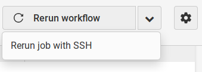
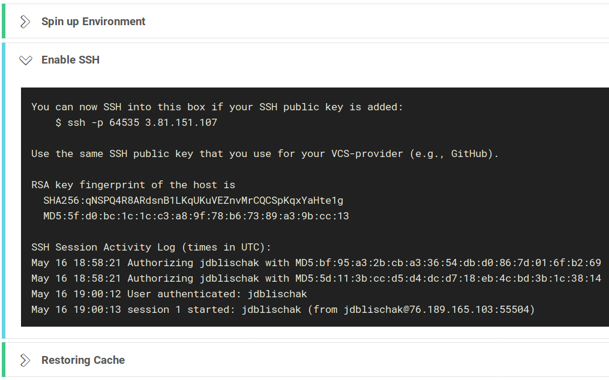
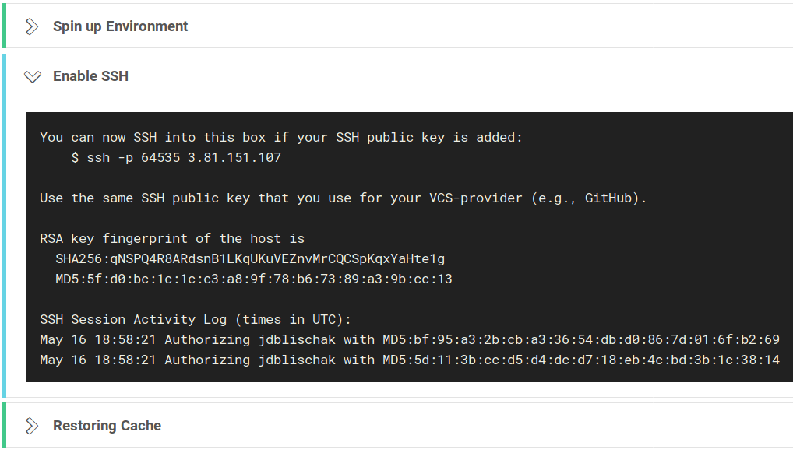
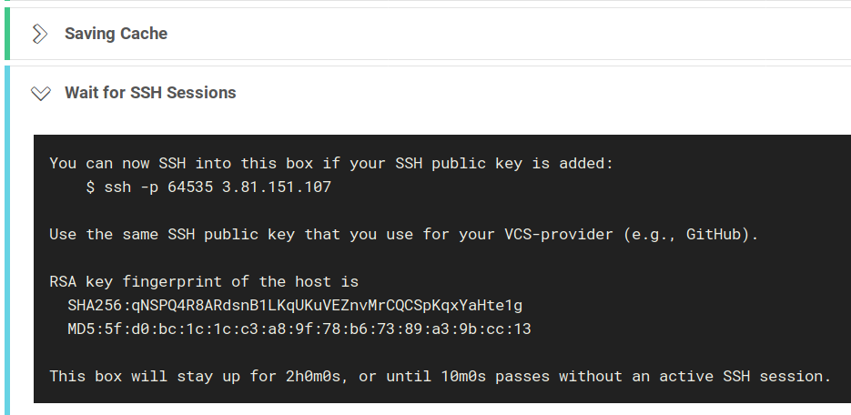

If you're testing your R package on CircleCI (see my previous posts on the
[basic setup][] and [more advanced configuration][]), you'll inevitably need to
debug some issue with the build process. I have previously explained how to
debug your R package on [Travis CI via SSH][] and on [AppVeyor via Remote
Desktop][]. Fortunately debugging is much easier with CircleCI.

## Debug locally with Docker {#local}

If you have Docker installed on your local machine, you can recreate the exact
environment locally. Run the command below to enter a Docker container that has
your R package copied to the directory `/project` (this is the directory that
CircleCI uses by default):

```
docker run --rm -it -v <absolute path to R pkg>:/root rocker/verse:3.6.0 bash
```

Make sure to use an absolute path to your R package and also to specify `bash`
as the command to execute (otherwise it starts `R`, and some other rocker
containers start RStudio Server).

Once you've entered the running Docker container, you first need to run `cd
project/` to enter your Git repository. Note that these files are not copies;
they are the files from your local machine mounted as a volume into the Docker
container. Thus any changes you make will be reflected in the local file system.

From here you can recreate the build process. If your build steps are contained
in bash scripts, you can run them one by one. Alternatively you can copy-paste
from your `.circleci/config.yml` file until you reach the step that needs to be
debugged interactively.

Lastly, in case you need extra software for debugging that you don't have
installed for the standard build, you can install these with APT^[Assuming
you're using one of the [rocker][] Docker images, which use Debian.]. For
example, the lines below will install the nano text editor.

[rocker]: https://github.com/rocker-org/rocker

```
apt update
apt install -y nano
```

## Debug remotely with SSH {#remote}

If you don't have Docker installed on your local machine, it is still convenient
to debug CircleCI remotely. Unlike for Travis CI, it is completely secure.
Unlike AppVeyor, it is easy to setup.

First, login to CircleCI using your GitHub or Bitbucket account. Then navigate
to the failing job and select the dropdown arrow in the top right to click
"Rerun job with SSH".



Second, after it spins up the container, it will enable SSH. It is completely
secure because for authentication it uses the public SSH key(s) that you've already uploaded to
GitHub or Bitbucket.



Furthermore, when you connect via SSH, you can confirm that the RSA key
fingerprint matches what CircleCI listed.

```
$ ssh -p 64535 3.81.151.107
The authenticity of host '[3.81.151.107]:64535 ([3.81.151.107]:64535)' can't be established.
RSA key fingerprint is SHA256:qNSPQ4R8ARdsnB1LKqUKuVEZnvMrCQCSpKqxYaHte1g.
Are you sure you want to continue connecting (yes/no)? yes
Warning: Permanently added '[3.81.151.107]:64535' (RSA) to the list of known hosts.
```

And once you've logged in, CircleCI updates this activity in real time, so you
could see if someone else was accessing your build.



After SSH is enabled, the build continues. Thus you can simply wait until the
build progresses to the current error that needs to be debugged, and everything
will be setup for you.

Lastly, you should have plenty of time for debugging because it will stay
connected for up to two hours as long as you are logged in.



## Conclusion

Another benefit of using CircleCI is that its interactive debugging is
straightforward and secure. No tokens, exposed secrets, or complex setup steps.

How could this debugging guide be improved? I assume it's possible to run
RStudio Server and access it via your browser^[Unless CircleCI's servers block
port 8787.]. If you know how to do this, please let me know and I'll add the
instructions to this post.

Happy debugging!
