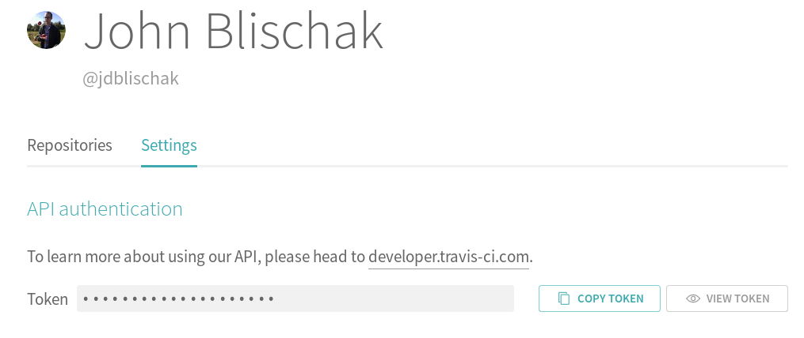

Ideally if `R CMD check` passes on your local machine, then hopefully it will
also pass when run on remote CI servers. But of course this isn't always the
case, and it's a great way to find bugs (since your users won't have the exact
same setup as your local machine). Often the error messages are sufficient for
you to be able to guess at the solution. But if you've pushed multiple commits
to try and fix the problem, and the CI jobs are still failing, it is probably
worth investing the time to interactively debug the job on the remote server. In
this post, I'll describe how to do this for Travis CI. Travis CI documents the
process in [Running Build in Debug Mode][travis-debug], and below I tailor this
specifically for debugging R packages.

[travis-debug]: https://docs.travis-ci.com/user/running-build-in-debug-mode/

## travis-ci.com vs travis-ci.org

Before going any further, you should go check the URL of your Travis CI jobs,
because this will affect the steps below. Initially Travis CI hosted open source
repositories on travis-ci.org and private repositories on travis-ci.com.
However, now they are migrating all projects to  use travis-ci.com. Thus if you
setup Travis prior to May 2018, you are likely using travis-ci.org; whereas if
you set it up post May 2018, you are likely using travis-ci.com. See the
documentation [Open Source on travis-ci.com][travis-open-source] for all the
details. Currently the migration of open source projects from travis-ci.org to
travis-ci.com is in [Beta][travis-beta], so I wouldn't recommend trying to
migrate your repository unless you were really motivated to use the new GitHub
App version of Travis CI.

[travis-beta]: https://docs.travis-ci.com/user/migrate/open-source-repository-migration
[travis-open-source]: https://docs.travis-ci.com/user/migrate/open-source-on-travis-ci-com/

## Email for debug access

To start, you'll need to email Travis CI support at <a
href="mailto:support@travis-ci.com" title="Email Travis CI
support">support@travis-ci.com</a> to activate debug mode for your repository.
They got back to me in about two hours.

The reason that this feature is not automatically enabled is for security
reasons. Below is the explanation from the email they sent me that confirmed
activation of debug mode:

> The reason this is not enabled by default for public repositories is that
anyone who happens to stumble across a log containing the SSH access can make a
connection to the VM and potentially read out the secret environment variables.

You can learn more in the section [Security
considerations][security-considerations]. Briefly, while only you are able to
initiate a debugging session, if someone with malicious intent were to be
watching that exact build log, they could also run the SSH command to login.
This is mainly a concern if you've added encrypted environment variables (e.g.
SSH deploy keys or personal access tokens). A standard setup to test an R
package, e.g. with `usethis::use_travis()`, does not involve any sensitive
information, so this likely isn't a concern for you.

[security-considerations]: https://docs.travis-ci.com/user/running-build-in-debug-mode/#security-considerations

## Get your API token

Once you've received your email confirmation from Travis CI support, you can
obtain your authentication token. The token allows only you to trigger a debug
build for your repository. Thus do not save this anywhere that others can view.
If you're using travis-ci.com, go to https://travis-ci.com/profile. If you're
using travis-ci.org, go to https://travis-ci.org/account/preferences (screenshot
below).



## Find job ID number

Next you need to find the job ID number of the job you want to restart in debug
mode. The key is to not use the build ID number. When you first go to the build
log, the URL will be
`https://travis-ci.<org|com>/<username>/<repository>/builds/<build ID>`. When you
click on the individual job that you want to debug, the URL will change to
`https://travis-ci.<org|com>/<username>/<repository>/jobs/<job ID>`. Copy-paste
the job ID. This isn't sensitive information (because it's already public), so
you don't need to be careful about it. If you only have one job, then click on
either "Job log" or "View config" to change the URL.

## Restart job in debug mode

With both the authorization token and job ID, you can trigger the Travis API to
restart the job in debug mode. Specifically you will use the [debug endpoint of
the Travis API v3][debug-endpoint].^[Note that this viewing the API
documentation requires you to login.]

[debug-endpoint]: https://developer.travis-ci.com/resource/job#debug

Open a terminal and copy-paste the following API call, replacing the
placeholders with your actual API token and job ID. Also make sure to change the
URL to travis-ci.com if that is what you are using.

```
$ curl -s -X POST \
  -H "Content-Type: application/json" \
  -H "Accept: application/json" \
  -H "Travis-API-Version: 3" \
  -H "Authorization: token <API token>" \
  -d "{\"quiet\": true}" \
  https://api.travis-ci.org/job/<job ID>/debug
```

If this is successful, it will return a JSON blob that looks like the following:

```
{
  "@type": "pending",
  "job": {
    "@type": "job",
    "@href": "/job/<job ID>",
    "@representation": "minimal",
    "id": <job ID>
  },
  "state_change": "created",
  "resource_type": "job"
}
```

Now go to the page of the job you just restarted. Recall that the URL will look
like `https://travis-ci.<org|com>/<username>/<repository>/jobs/<job ID>`. Once
the job starts, a few steps will be done prior to providing you SSH access:

* Install R
* Clone your Git repository
* Set any environment variables defined in `.travis.yml` or via the Travis
Settings
* Restore cached packages

Note that the last item could be a potential problem. If you suspect your errors
may be due to an outdated dependency, you will want to first clear the package
cache by clicking on "More options" -> "Caches" and deleting the relevant cache.

After these steps, the following message will be printed in the build log:

```
Debug build initiated by <username>
rm: cannot remove ‘/home/travis/.netrc’: No such file or directory
Setting up debug tools.
Preparing debug sessions.
Use the following SSH command to access the interactive debugging environment:
ssh <random string>@to2.tmate.io
This build is running in quiet mode. No session output will be displayed.
```

Copy-paste the `ssh` command into your terminal. Note that you'll likely receive
a warning about the authenticity of the host, which you can accept:

```
$ ssh RXkB2WDHNOeOAdYXumNzNU47f@to2.tmate.io
The authenticity of host 'to2.tmate.io (159.203.36.122)' can't be established.
ECDSA key fingerprint is SHA256:8GmKHYHEJ6n0TEdciHeEGkKOigQfCFuBULdt6vZIhDc.
Are you sure you want to continue connecting (yes/no)? yes
```

This will drop you into a [tmate][]^[A fork of [tmux][]] session. Note that the
tmate terminal behaves a little differently than a typical terminal. You can
move up and down the command history with the up and down arrows, but if you
want to do anything more complicated, e.g. reverse search, you'll need to first
invest some time in learning the [tmux key bindings][tmux-key-bindings].

[tmate]: https://tmate.io/
[tmux]: https://tmux.github.io/
[tmux-key-bindings]: https://man.openbsd.org/OpenBSD-current/man1/tmux.1#DEFAULT_KEY_BINDINGS

Now you can start interactively debugging your package! The next steps will be
specific to your package and the given error. If one of your dependencies is
failing to install, you can open R and try to install a previous version. Or you
could try installing some system libraries with APT. If the error is in the
check step, you can run the installation step with the [convenience
function][travis-convenience] `travis_run_install`. There are convenience
functions for each of the potential steps in `.travis.yml`, and you can see the
default steps in the [R-specific build documentation][travis-r-build].

If you know that `R CMD check` results in a warning or an error, do not run
`travis_run_script`. The SSH session will automatically terminate if there is an
error. Instead you can run `devtools::install()` to install your R package and
then interactively test it. If you're using [testthat][], you can run
`devtools::test(filter = "<string>")` to run the specific tests that are
failing.

[testthat]: https://testthat.r-lib.org/
[travis-convenience]: https://docs.travis-ci.com/user/running-build-in-debug-mode/#convenience-bash-functions
[travis-r-build]: https://docs.travis-ci.com/user/languages/r#customizing-the-travis-build-steps

To give you a sense of how much control you have, the last time I had to
interactively debug my R package, I suspected that pandoc 2 was causing the
issue. Thus after running `devtools::test()` to confirm the error, I [installed
pandoc][pandoc-install] 1.19.2.1^[This was the latest of the 1.x series that had
a [deb file][pandoc-deb] available.] and then reran `devtools::test()` to
confirm the error was fixed.

```
sudo apt remove pandoc
wget https://github.com/jgm/pandoc/releases/download/1.19.2.1/pandoc-1.19.2.1-1-amd64.deb
sudo dpkg -i pandoc-1.19.2.1-1-amd64.deb 
```

[pandoc-deb]:  https://github.com/jgm/pandoc/releases/tag/1.19.2.1
[pandoc-install]: https://github.com/jgm/pandoc/blob/master/INSTALL.md#linux

## Miscellaneous

A few final notes that may be helpful as you debug your Travis build:

* The working directory when you login is
`/home/travis/build/<username>/<repository>`
* The home directory is `/home/travis`
* The debugging session will automatically end after 50 minutes, which is the
time limit for open source jobs on Travis CI

## Conclusion

With any luck you won't have to interactively debug your R package directly on a
Travis server. But if you can't replicate the error locally, using debug mode is
much easier than debugging by the method of guess-push-hope-repeat.

Do you have any tips for debugging an R package on Travis? Any
harrowing debugging adventures to share?
