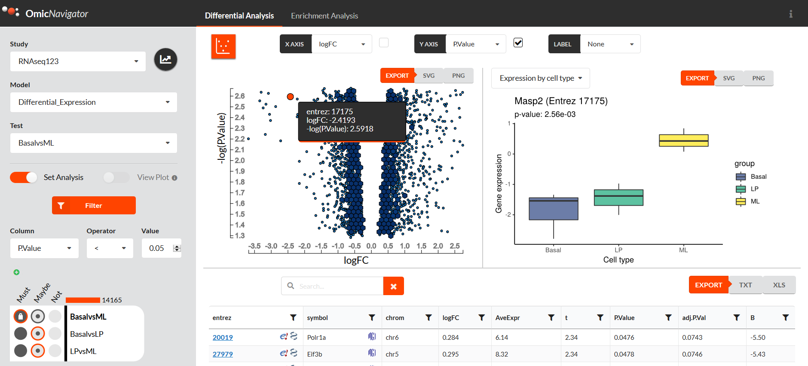
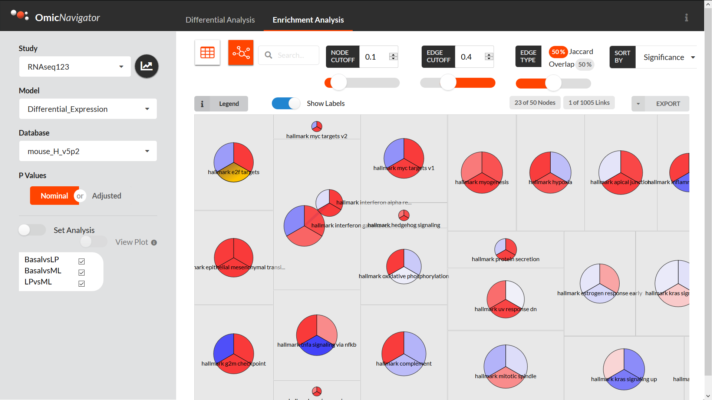

**tl;dr** We built an interactive web app for exploring the results of genomics
assays: OmicNavigator. You input your data with R, and then OmicNavigator
instantly creates a dynamic web app for you to use and share with your
collaborators! Available from [CRAN][cran] and [GitHub][github].

[cran]: https://cran.r-project.org/package=OmicNavigator
[github]: https://github.com/abbvie-external/OmicNavigator

## Overview: Facilitating collaborative omics research

The motivation to build OmicNavigator arose from the desire to improve research projects
at [AbbVie][abbvie] that involved high-throughput omics assays. These are highly
collaborative projects that require expertise of both disease specialists and
bioinformaticians. The disease specialists need to explore the results in-depth,
but they are often dependent on the bioinformaticians to query and visualize the
data. And the bioinformaticians' time is best spent on performing statistical
analyses and generating custom visualizations. Any time spent generating generic
boxplots or yet another basic Shiny app is time they could have spent on more
high-value activities. OmicNavigator to the rescue! OmicNavigator aims to
facilitate these routine interactions and streamline the research project for
all participants:

[abbvie]: https://www.abbvie.com/

* **Disease specialist:** Instead of emailing your collaborator each time you
want to explore a new gene of interest, you can open your browser and explore
all the study results whenever you want. You can also perform your own filters
to subset the data to the genes you think are the most interesting, and export
the plots to include in your presentations.

* **Bioinformatician:** The next time you perform a differential expression and
enrichment analysis, you can send your collaborators to your OmicNavigator web app to
explore the results. You don't have to become a web dev expert. You can instead
spend your time creating custom visualizations, which you can then integrate
into OmicNavigator, and your collaborators will be able to auto-generate your
plots for whichever genes they dynamically select in the app.

* **Manager:** OmicNavigator is able to display the results of many studies from
the same interface. You just have to choose which study to explore in the drop
down menu. Instead of having the results from each project scattered in
different locations, you can have them all in one place.

* **Data curator**: The data in OmicNavigator studies are organized in a uniform
way. Thus instead of having to manually curate each project's data, you can
write scripts to automatically convert OmicNavigator data files into the format
you need.

* **Web developer:** If you're a web developer that needs to integrate results
stored in OmicNavigator into your application, you don't need to worry about
learning R or waiting for the bioinformatician to package the data into the
format you need. The data in OmicNavigator studies is accessible from a standard
API and exportable in many formats, e.g. JSON (more on that below in the section
[Architecture](#architecture)). You can have your app query the OmicNavigator
API to always automatically download the latest data.

## App features

The app has two main panes: one for differential expression results and one for
enrichment results.

The differential expression pane includes:

* a dynamic results table that you can search, filter, sort, etc.

* an interactive scatter plot. If you drag and select points in the plot, the
table is automatically filtered to only include these features. A typical use
case is creating a "volcano"-style plot, but you can compare any two numeric
columns that you like

* Custom R plots. If the bioinformatician has added any custom plots, you can
select any gene to visualize it (and export the plot if needed)

* A filter to subset genes based on the results from all the available tests.
This makes it easier to e.g. find genes that are significantly differentially
expressed in one test but not others



The enrichment analysis pane includes:

* a dynamic table with the enrichment results that you can search, filter, sort, etc.

* a network view for visualizing the relationships between the various terms
used for enrichment (e.g. how many genes are in common between the terms)

* a "barcode" view for investigating the genes driving the enrichment of a term
in an interactive barcode plot

* A filter to subset genes based on the enrichment results from all the
available tests. This makes it is easier to e.g. find terms that are significantly
enriched in one test but not others



There are even more existing features, e.g. custom plots for visualizing
multiple features at once, and more features in development, but the above
should give you a good sense of the app's capabilities.

## Create an OmicNavigator study with your own data

After performing the statistical analysis, the bioinformatician deposits the
data into an OmicNavigator study. This should require minimal data manipulation
since OmicNavigator provides helper functions to ingest data frames directly in
R. Once assembled, OmicNavigator exports the data as an R package for
consumption by the web app.

And you don't need to include every single piece of potential data. The app only
enables the features that are supported based on the available data. For
example, if you didn't perform an enrichment analysis, you can still use
OmicNavigator to share differential expression results.

Below is a quick start guide to give you an idea of how this works. To learn
more, check out the extensive [User's Guide][users-guide] and [example
study][example-study].

[users-guide]: https://cran.r-project.org/web/packages/OmicNavigator/vignettes/OmicNavigatorUsersGuide.pdf
[example-study]: https://github.com/abbvie-external/OmicNavigatorExample

```{r quickstart, eval=FALSE}
# Install and load the package
install.packages("OmicNavigator", dependencies = TRUE)
library(OmicNavigator)

# Create a very minimal study with a single results table
quickstart <- createStudy("quickstart")
data("RNAseq123")
head(basal.vs.lp)
resultsTable <- basal.vs.lp[, -2:-3]
quickstart <- addResults(quickstart, list(model = list(test = resultsTable)))
installStudy(quickstart)

# (optional) Install the example study RNAseq123 which demos many of the app's
# available features
install.packages(c("gplots", "viridis"))
tarball <- "https://github.com/abbvie-external/OmicNavigatorExample/releases/latest/download/ONstudyRNAseq123.tar.gz"
install.packages(tarball, repos = NULL)

# Install and start the web app
installApp()
startApp()
```

## Architecture

The central piece of infrastructure is [OpenCPU][opencpu], an amazing framework
for creating web apps with R. The basic idea behind OpenCPU is that is exposes
all the functions in the R packages installed on the machine via a uniform HTTP
API. This makes it possible for web apps to harness the power of R without R
developers having to perform extra steps to make their code deployable.

[opencpu]: https://www.opencpu.org/

This is an incredibly powerful paradigm. It lets me as the R developer use all
the tools I am familiar with. My code is organized as an R package, my functions
are documented, I'm able to easily test my functions since they return standard
R objects like lists and data frames. Then my collaborators developing the
front-end JavaScript app are able to call my R functions via HTTP and request
JSON formatted data in return. They don't have to worry about R-specific things
like data frames and factors; in fact, they don't even need to install R! They
are able to focus on the front-end using whichever tools they prefer, in this
case [React][react] and [D3][d3].

[react]: https://reactjs.org/
[d3]: https://d3js.org/

And because OpenCPU is serving the R functions via a standard HTTP API, other
developers can query and access the data for inclusion in other apps throughout
the organization. By default OpenCPU provides many [options for output
formats][output-formats], including JSON, NDJSON, and protocol buffers.

[output-formats]: https://www.opencpu.org/api.html#api-formats

In summary, OpenCPU allows us to take advantage of the best of the R and
JavaScript ecosystems.

## Comparison to other dashboard-like tools

There are lots of options for creating dashboards. OmicNavigator aims to
complement these existing options. OmicNavigator provides dynamic web app
capabilities to the R user while also allowing them to customize the app with
bespoke plotting functions. 

To best illustrate how OmicNavigator fits in, below I compare it to some other
available options:

* **Point-and-click GUIs:** While the app itself is point-and-click, it is
created and deployed by the R user. This allows them to easily update their
study. When new data arrives, or they add a new statistical model, simply update
the data-in script and re-export the OmicNavigator study

* **Dashboard frameworks:** Frameworks like [Shiny][shiny] and [streamlit][]
enable you to quickly create a custom dashboard from scratch using R and Python,
respectively. This is super useful, but can also be time-consuming.
OmicNavigator attempts to cover the common use cases of reporting differential
expression results so that the bioinformatician can spend their time developing
bespoke dashboards for the unique aspects of a particular study

[shiny]: https://shiny.rstudio.com/
[streamlit]: https://streamlit.io/

## Acknowledgements

OmicNavigator is the brain child of [Brett Engelmann][bengalengel]. The web app
has been primarily developed by [Paul Nordlund][paulnordlund], [Terry
Ernst][ternst23], and [Joe Dalen][JoeDalen81]. Additional contributors include
Justin Moore, Akshay Bhamidipati , and [Marco Curado][curadomr].

[bengalengel]: https://github.com/bengalengel
[paulnordlund]: https://github.com/paulnordlund
[ternst23]: https://github.com/ternst23
[JoeDalen81]: https://github.com/JoeDalen81
[curadomr]: https://github.com/curadomr


And of course thanks to AbbVie for supporting the development of this open
source tool!
