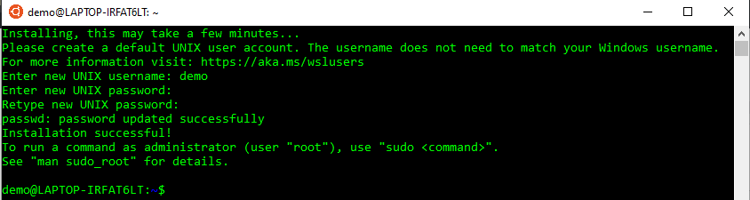
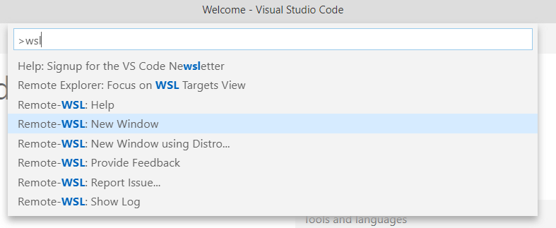
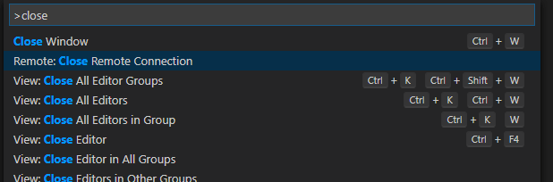
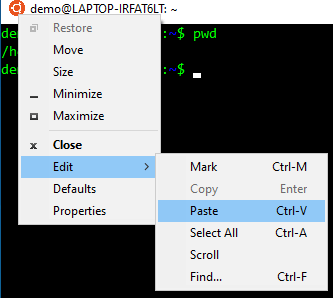

## Introduction

The [Windows Subsystem for Linux][wsl] (WSL) is really impressive. It provides a
convenient and smooth experience for running Ubuntu (and other Linux
distributions) from Windows because the Linux executables are able to run
natively on the Windows machine. In the past, I've tried running Ubuntu in a
[virtual machine](https://en.wikipedia.org/wiki/Virtual_machine), but it was
painfully slow, so much so that I never really used it for real work.^[Not to
mention that sharing host files with the VM requires [additional
setup](https://www.howtogeek.com/189974/how-to-share-your-computers-files-with-a-virtual-machine/).]
I've also dual-booted multiple machines, but I always found reformatting the
hard drive to be a nerve-wracking and time-consuming experience. And while I
productively used a dual-boot setup for years, I essentially only used Ubuntu
during that time. Only in the rare occasion that I had to use Adobe Illustrator
would I boot into Windows. Finally with the WSL, using both Windows and Ubuntu
is realistic.

I've experimented with the WSL since early 2018 after [David
Smith](https://twitter.com/revodavid) provided instructions for [installing R in
the
WSL](https://blog.revolutionanalytics.com/2017/12/r-in-the-windows-subsystem-for-linux.html)
and [Jeroen Ooms](https://twitter.com/opencpu) announced that [you can host
RStudio Server and OpenCPU apps from the
WSL](https://twitter.com/opencpu/status/941115822705119232). However, the most
I've used it for real work was for speed benchmarking my R package
[workflowr](https://github.com/jdblischak/workflowr).^[For whatever reason,
read/write operations and filepath manipulations, e.g. converting an absolute
path to a relative path, take a lot longer on Windows 10. On the WSL, which has
access to the same computational resources on my laptop as Windows, workflowr
functions run a lot faster.] However, for one of my current freelance jobs, I
was provided a Windows laptop. With RStudio and [Git
Bash](https://gitforwindows.org/), I've been productively developing on Windows
for the past couple of months. But it has been noticeably slower. Recently I had
some code that was taking minutes to run on Windows, so I tried it on the WSL,
and it ran it in seconds. This finally convinced me that I should really switch
over to primarily using the WSL.

In this post, I'll describe how to install the WSL, configure it for R
development, and share other tips and tricks.

[wsl]: https://en.wikipedia.org/wiki/Windows_Subsystem_for_Linux

## Install Windows Subsytem for Linux from the Windows Store

The easiest method for installing the WSL is to use the Windows Store. Follow
these steps:

1. Confirm that the WSL feature is enabled for Windows.
    a. Open the Settings app, search for "windows features", and select "Turn
       Windows features on or off". Annoyingly I can't find a way to navigate to
       these settings without having to use the search bar.
    
    a. Scroll down and confirm that Windows Subsystem for Linux is enabled. If
       it wasn't previously enabled, you'll need to restart your computer.
    
1. Open the Microsoft Store app (you open it like any other app), search for
   "Ubuntu", and choose the most recent LTS version (currently 18.04).

1. Click on "Install" (or "Get" if you access the Microsoft Store in the
   browser) and login with your Microsoft Account.
1. Open the Ubuntu app. Enter a username and password. As the directions state,
   this username and password is in **no** way related to your Windows user
   account.


## Install Windows Subsytem for Linux from PowerShell

On my work laptop, IT blocked the Microsoft Store app. And when I tried the
Microsoft Store via the browser, the "Get" link failed (in multiple browsers, so
I assume IT somehow also blocked this). If you find yourself in a similar
situation, or if you simply don't want to create a Microsoft Account, you can
perform all the steps above from a PowerShell terminal.

1. Enable the WSL feature and restart your computer
   ([source](https://docs.microsoft.com/en-us/windows/wsl/install-win10#install-the-windows-subsystem-for-linux)).

    ```
    Enable-WindowsOptionalFeature -Online -FeatureName Microsoft-Windows-Subsystem-Linux
    ```

1. Download Ubuntu
   ([source](https://docs.microsoft.com/en-us/windows/wsl/install-manual#download-using-powershell)).

    ```
    Invoke-WebRequest -Uri https://aka.ms/wsl-ubuntu-1804 -OutFile Ubuntu.appx -UseBasicParsing
    ```

1. Install Ubuntu
   ([source](https://docs.microsoft.com/en-us/windows/wsl/install-manual#installing-your-distro)).

    ```
    Add-AppxPackage .\Ubuntu.appx
    ```

1. Open Ubuntu and configure your username and password, as described above.

## Install software with APT

You can install software using the package manager
[APT](https://en.wikipedia.org/wiki/APT_(software)). The very first thing you
should do after installing Ubuntu is to upgrade the software. You'll need to
enter your Ubuntu password to run commands as the root user (`sudo`).

```
# Check for latest package versions
sudo apt update
# Upgrade currently installed packages
sudo apt upgrade
# Install emacs and unzip. Enter "y" to accept
sudo apt install emacs unzip
```

It's a good habit to regularly update the software by running `sudo apt update
&& sudo apt upgrade`.

The software versions available from the default sources used by APT eventually
become outdated if you don't regularly upgrade Ubuntu. Ubuntu 18.04 was
[released in April
2018](https://en.wikipedia.org/wiki/Ubuntu_version_history#1804), so this is
definitely a potential issue. The solution to this is to install more recent
versions from [Personal Package Archives](https://launchpad.net/ubuntu/+ppas)
(PPAs).

For example, the versions of Git available in the default channels are 2.17.0
and 2.17.1.^[Note that bionic refers to Bionic Beaver, the release name for
Ubuntu 18.04.]

```
$ apt list -a git
Listing... Done
git/bionic-updates,bionic-security,now 1:2.17.1-1ubuntu0.5 amd64 [installed,automatic]
git/bionic 1:2.17.0-1ubuntu1 amd64
```

Fortunately, the Git developers provide a PPA to [install the latest stable
upstream version](https://git-scm.com/download/linux), which can be added using
the command below:

```
sudo add-apt-repository ppa:git-core/ppa
```

And now Git 2.26.0 is available for download:

```
$ apt list -a git
Listing... Done
git/bionic 1:2.26.0-1~ppa1~ubuntu18.04.1 amd64 [upgradable from: 1:2.17.1-1ubuntu0.5]
git/bionic-updates,bionic-security,now 1:2.17.1-1ubuntu0.5 amd64 [installed,upgradable to: 1:2.26.0-1~ppa1~ubuntu18.04.1]
git/bionic 1:2.17.0-1ubuntu1 amd64
```

Running `sudo apt upgrade` will replace Git 2.17.1 with 2.26.0.

## Install R

R is available for installation with APT, but similar to Git, it is outdated (R
3.4.4 was released in March 2018):

```
$ apt list r-base
Listing... Done
r-base/bionic 3.4.4-1ubuntu1 all
```

The official [CRAN Ubuntu installation
instructions](https://cran.r-project.org/bin/linux/ubuntu/README.html) describe
how to manually edit the file `/etc/apt/sources.list`, which lists the sources
for APT to check for available software. However, since I am recommending the
use of PPAs, I think it is easier to directly add Michael Rutter's [RRutter v3.5
PPA](https://launchpad.net/~marutter/+archive/ubuntu/rrutter3.5).^[Don't be
concerned about the 3.5. There was a big change between versions 3.4 and 3.5 in
how R was packaged for Debian/Ubuntu. We're far enough away from that event that
you shouldn't have to worry about it. Just remember that for the latest version
of R, you want the 3.5 version.] This is the source PPA that is synced to CRAN,
so it is identical to the official CRAN source.

```
sudo add-apt-repository ppa:marutter/rrutter3.5
```

Instead of manually editing `/etc/apt/sources.list`, the command above added the
new source in a separate file in the directory `/etc/apt/sources.list.d/`. Note
that the Git PPA is also there. For me, this makes it easier to manage PPAs. You
can quickly view which PPAs you are using, and you know which file to edit if
you need to update or disable the PPA.

```
$ ls /etc/apt/sources.list.d/
git-core-ubuntu-ppa-bionic.list  git-core-ubuntu-ppa-bionic.list.save  marutter-ubuntu-rrutter3_5-bionic.list
```

Now R 3.6.3 is available to install:

```
$ apt list -a r-base
Listing... Done
r-base/bionic 3.6.3-1bionic all
r-base/bionic 3.4.4-1ubuntu1 all
```

Before you install R, an optional but advisable step is to [register Michael
Rutter's signing
key](https://cran.r-project.org/bin/linux/ubuntu/README.html#secure-apt) to
ensure the binaries you are installing on your machine are actually the ones he
uploaded to his PPA. Note you'll need to have admin access to your Windows
machine for this step.

```
sudo apt-key adv --keyserver keyserver.ubuntu.com --recv-keys E298A3A825C0D65DFD57CBB651716619E084DAB9
```

If you have trouble connecting to the server and you use a VPN, try
disconnecting from it. Also, the CRAN instructions have alternative commands to
try. The below option worked for me on my work laptop:

```
gpg --keyserver hkp://keyserver.ubuntu.com:80 --recv-keys E298A3A825C0D65DFD57CBB651716619E084DAB9
gpg -a --export E298A3A825C0D65DFD57CBB651716619E084DAB9 | sudo apt-key add -
```

Install `r-base` (which includes `r-base-core`, `r-base-dev`, the documentation
files, and the set of recommended packages in ` r-recommended`).

```
sudo apt install r-base
```

## Install R packages

To install R packages, you could rely on `install.packages()`. But unlike
Windows and macOS, CRAN does not build binaries for any of the Linux
distributions. This means that every package is installed from source, so
packages like stringi will take minutes to install each time there is a new
release. Thus I try as much as possible to rely on the binaries built for
Ubuntu.^[See this recent blog post from Jumping Rivers on various strategies for
[Faster R package
installation](https://www.jumpingrivers.com/blog/faster-r-package-installation-rstudio/).]
There are almost 500 R package binaries available for Ubuntu.

```
$ apt list r-cran-* 2> /dev/null | wc -l
496
```

Unfortunately the RRutter v3.5 PPA (and its equivalent CRAN sync) added above
only includes R itself and the dozen or so recommended packages. The remaining
packages will be the version from when R 3.4.4. was released years ago, which
isn't very useful.

Luckily Michael Rutter maintains a second PPA,
[cran2deb4ubuntu_3.5](https://launchpad.net/~marutter/+archive/ubuntu/c2d4u3.5),
that builds binaries for all the packages listed in the [CRAN Task
Views](https://cran.r-project.org/web/views/) (and their package dependencies),
and these packages are regularly updated. It's not immediate, but if you
regularly upgrade your APT packages, you'll have the latest version of any given
R package within a few days of its release to CRAN. Add this PPA to access over
4000 R package binaries.

```
sudo add-apt-repository ppa:marutter/c2d4u3.5
$ apt list r-cran-* 2> /dev/null | wc -l
4525
```

This allows you to install the entire tidyverse suite of R packages plus their
system dependencies in only a few minutes.

```
sudo apt install r-cran-tidyverse
```

If a package you want isn't available when you try to install `r-cran-foo` (note
that the R package should always be lowercase), then you can install it with
`install.packages()` into a personal library directory.

## Install Bioconductor packages

There are a decent number of Bioconductor packages available for Ubuntu, but
they are all outdated.

```
$ apt list r-bioc-* 2> /dev/null | wc -l
84
```

Thus I recommend installing
[BiocManager](https://cran.r-project.org/package=BiocManager) with APT. It's
part of the c2d4u PPA, so it will be kept up-to-date.

```
sudo apt install r-cran-biocmanager
```

And then you can install individual Bioconductor packages as needed from within
R:

```
BiocManager::install(c("GenomicRanges", "SummarizedExperiment"))
```

This will unfortunately take awhile since the packages are built from source.

If some packages fail to install, it is likely due to the new [staged install
check](https://developer.r-project.org/Blog/public/2019/02/14/staged-install/index.html)
introduced in R 3.6. I got this [error trying to install
Biobase](https://github.com/Bioconductor/Biobase/issues/5), and others have
reported WSL-specific issues, e.g. for
[Biobase](https://stackoverflow.com/questions/56241007/non-zero-exit-status-r-3-6-0-biobase)
and
[ps](https://stackoverflow.com/questions/56615734/r-package-ps-fails-to-install-because-permission-denied-to-mv-in-final-step-of).
A workaround is to disable this check prior to installation by setting an
environment variable with `Sys.setenv(R_INSTALL_STAGED = FALSE)`.

## Install OpenCPU server

Unless you're a devoted emacs or vi user, you probably aren't overly excited
about the prospect of doing all of your R development from a bash shell. You're
in luck! As I mentioned at the beginning of the post, Jeroen Ooms' amazing
[OpenCPU project](https://www.opencpu.org/download.html) conveniently provides
all the infrastructure to install and serve RStudio Server via the Apache web
server.^[Serving RStudio Server is a very limited use case for OpenCPU. It's
primary purpose is for converting R code into web applications. This post is
already too long to include a detailed description, but you should check out the
[example apps](https://www.opencpu.org/apps.html) to get a sense of the
possibilities.]

As you might have guessed, the first step is to add the OpenCPU PPA. Then you
can install OpenCPU server, which also installs the Apache web server, and
RStudio Server. Note that you will be prompted about email addresses. Since you
are not setting up an email server, you can accept the default settings. Also,
you'll again need to have admin rights to install Apache and RStudio Server.

```
sudo add-apt-repository -y ppa:opencpu/opencpu-2.1
sudo apt install opencpu-server
sudo apt install rstudio-server
```

Note that the [OpenCPU
PPA](https://launchpad.net/~opencpu/+archive/ubuntu/opencpu-2.1) is versioned,
i.e. the `2.1`. Instead of updating the software in one PPA, he creates new ones
(thus each PPA is stable long-term). Therefore you might want to check back in
the future to see if there is a new PPA available.^[Also note that his PPA
contains r-base and the r-recommended packages. These will eventually become
outdated, but since you've added the [RRutter v3.5
PPA](https://launchpad.net/~marutter/+archive/ubuntu/rrutter3.5), you'll
continue to get the latest version of R from there. Thus you are only relying on
the OpenCPU PPA for OpenCPU server, Apache, and RStudio Server.]

Now you should be able to navigate to http://localhost/rstudio/ with your
browser. This is the RStudio Server you are running in the Ubuntu WSL. Login
with your Ubuntu username and password, and then run `sessionInfo()` to confirm.

RStudio Server is setup automatically when you first install it. However, the
next time you start your machine and open Ubuntu, it won't be ready to use. Thus
I always create a file called `start.sh` that contains the startup steps from
the [OpenCPU Server
Manual](https://opencpu.github.io/server-manual/opencpu-server.pdf):

```
#!/bin/bash
set -eux

# Enable OpenCPU for Apache
a2ensite opencpu

# Restart Apache
apachectl restart

# Start RStudio Server
rstudio-server start
```

You'll need root access, so execute it with `sudo bash start.sh`. Then you'll
once again be able to access RStudio Server via your browser at
http://localhost/rstudio/. Importantly, the RStudio Server will continue running
even if you close the Ubuntu terminal. Thus the only time you need to re-run
`start.sh` is after you shutdown your computer.

The above instructions work fine on my personal laptop running Windows 10 Home
edition. However, I wasn't able to use port 80 on my work laptop running Windows
10 Pro.

```
$ sudo bash start.sh
+ a2ensite opencpu
Site opencpu already enabled
+ apachectl restart
httpd not running, trying to start
(13)Permission denied: AH00072: make_sock: could not bind to address [::]:80
(13)Permission denied: AH00072: make_sock: could not bind to address 0.0.0.0:80
no listening sockets available, shutting down
AH00015: Unable to open logs
Action 'restart' failed.
The Apache error log may have more information.
```

If you also receive the error about not being able to bind to port 80, then
follow the instructions in this [Ask Ubuntu
answer](https://askubuntu.com/questions/338218/why-am-i-getting-permission-denied-make-sock-could-not-bind-to-address-when/338239#338239).
The default port used by Apache is 80, which you can verify by viewing the ports
configuration file.

```
$ cat /etc/apache2/ports.conf
# If you just change the port or add more ports here, you will likely also
# have to change the VirtualHost statement in
# /etc/apache2/sites-enabled/000-default.conf

Listen 80

<IfModule ssl_module>
        Listen 443
</IfModule>

<IfModule mod_gnutls.c>
        Listen 443
</IfModule>

# vim: syntax=apache ts=4 sw=4 sts=4 sr noet
```

To get around a blocked port 80, edit that file (`sudo nano
/etc/apache2/ports.conf`) so that Apache listens on any high port, e.g. `Listen
8080`. After changing the port, you can access RStudio Server in the browser by
including the port in the URL, e.g. http://localhost:8080/rstudio/.

Note that you'll still probably receive a warning like `[core:warn] [pid 62]
(92)Protocol not available: AH00076: Failed to enable APR_TCP_DEFER_ACCEPT`. You
can safely ignore this because its a known issue and it doesn't affect Apache's
ability to run ([source](https://github.com/Microsoft/WSL/issues/1953)).

Since we are discussing editing ports, it's a good time to discuss security.
With this setup, you are running a web server on your local machine. Now this
shouldn't be a big deal, since if your computer was open to outside network
traffic, you'd have way bigger problems
([source](https://security.stackexchange.com/questions/6798/how-safe-is-it-to-install-xampp-on-my-home-computer-to-test-php-code/6807#comment11479_6807)).
But if you are worried about any potential issue, you can be overly cautious and
restrict Apache to only listen to ports on your local machine, i.e. `localhost`
or the equivalent IP address `127.0.0.1`. In other words, edit
`/etc/apache2/ports.conf`, replacing `Listen 8080` and `Listen 443` with `Listen
127.0.0.1:8080` and `Listen 127.0.0.1:443`
([source](https://security.stackexchange.com/a/6807)).

## SSH keys

To make it easy to clone, push, and pull repositories from online Git hosting
services, e.g. GitHub, you'll want to create SSH keys on the WSL and register
them with the service. I recommend the instructions from
[GitHub](https://help.github.com/en/github/authenticating-to-github/generating-a-new-ssh-key-and-adding-it-to-the-ssh-agent),
which I've modified below. Note that I added the flag `-o` to use the newer,
more secure OpenSSH format for creating the key.

```
# Create new SSH keys
ssh-keygen -o -t rsa -b 4096 -C "Any message you would like to annotate the key"
# Start the SSH agent
eval "$(ssh-agent -s)"
# Add SSH key to SSH agent
ssh-add ~/.ssh/id_rsa
```

Once you've created the key pair, you can [copy the public key to
GitHub](https://help.github.com/en/github/authenticating-to-github/adding-a-new-ssh-key-to-your-github-account)
and/or the other services you use.

Unfortunately the experience with using SSH keys is not as seamless as it is
with a standard Ubuntu installation. If you use a passphrase with your SSH key,
you will be prompted to enter your passphrase every time. On standard Ubuntu,
you only have to enter it the first time you use your key after restarting your
computer. I found a workaround for this, but it is hacky, so please let me know
if you know of a better solution. First, add the line `eval "$(ssh-agent -s)"
>/dev/null` to `~/.bashrc` so that the agent is automatically started each time
you open a window. ^[I got this idea from this [blog
post](https://chaijiaxun.com/automatically-starting-ssh-agent-for-windows-10-bash/).
However, I don't agree with all of his conclusions. He says that the ssh-agent
doesn't persist. When I run `ps -ef | grep ssh-agent`, it clearly persists
across sessions. But for whatever reason it doesn't work, and a new agent has to
be started. One reason I feel this is so hacky is that each time I open a
window, a new ssh-agent process is spawned.] Second, add the line
`AddKeysToAgent yes` to the file `~/.ssh/config`. Now you will only have to
enter your passphrase once, though you will have to do it for every new window
you open.

## Access Windows filesystem

Another nice feature of the WSL is that it is straightforward to access the
files on your Windows machine. Unlike a virtual machine or Docker container, you
don't have to take any extra steps to configure this. From Ubuntu, you can
access your Windows filesystem mounted at ` /mnt/c/`. For example, a common use
case for me is to download a file from the internet to my Windows desktop, and
then copy it to the WSL for analysis.

```
cp /mnt/c/Users/demo/Desktop/file.txt .
```

However, transferring files between Ubuntu and Windows has its gotchas, so
you'll want to use this feature sparingly. For example, if you want to access
your Git repos from Ubuntu and Windows, I'd recommend cloning them separately to
Windows and Ubuntu, i.e. treating them as if they were on separate machines.

Some guidelines:

* File paths are case-sensitive on Ubuntu, but not on Windows. This can create
  some real headaches. If you are accessing Windows files from Ubuntu via
  `/mnt/c/`, the WSL performs some magic so that the names are
  non-case-sensitive. But you really don't to rely on that behavior. Also, if
  you are creating files from Ubuntu on Windows, you can [configure the
  case-sensitivity of the filenames on a per-directory
  basis](https://devblogs.microsoft.com/commandline/per-directory-case-sensitivity-and-wsl/).
  But again, I'd recommend you avoid this complication by naming all your files
  on both Ubuntu and Windows such that they don't rely on case to be
  distinguished.

* Windows and Linux use different end of line characters to specify a
  [newline](https://en.wikipedia.org/wiki/Newline). This is the main reason I
  recommended above that you should keep separate copies of Git repos, otherwise
  you have [configure your Git settings to handle different line
  endings](https://code.visualstudio.com/docs/remote/troubleshooting#_resolving-git-line-ending-issues-in-wsl-resulting-in-many-modified-files),
  otherwise it will constantly look like all of your files have been edited.
  Confusingly, it may appear that the line endings are fine when copying back
  and forth because they display ok. I recommend running `dos2unix` after
  copying from Windows to Ubuntu, and `unix2dos` before copying from Ubuntu to
  Windows (you can install these tools with `sudo apt install dos2unix`).

* While you can, with caution, create or modify Windows files directly from
  Ubuntu, [**never** create or modify the Ubuntu files located in the AppData
  directory from
  Windows](https://devblogs.microsoft.com/commandline/do-not-change-linux-files-using-windows-apps-and-tools/).
  If you need to copy a file between the two, I recommend always doing this from
  the Ubuntu terminal via `/mnt/c/`. If you really want to edit Ubuntu files
  from Windows, you can run `explorer.exe .` in the Ubuntu terminal to launch
  Windows File Explorer, or you can access them from PowerShell using the path
  `\\wsl$\{distro name}\`, e.g. ` ls \\wsl$\Ubuntu-18.04\home\demo\`
  ([source](https://devblogs.microsoft.com/commandline/whats-new-for-wsl-in-windows-10-version-1903/)).

## VS Code remote extension

Another option for developing your code from the WSL is to use [Visual Studio
Code](https://code.visualstudio.com/). You can install the extension for [remote
development in the WSL](https://code.visualstudio.com/docs/remote/wsl).^[There
are similar extensions for remote development in [Docker
containers](https://code.visualstudio.com/docs/remote/containers) or in [any
remote machine accessible via
SSH](https://code.visualstudio.com/docs/remote/ssh), e.g. an HPC cluster. I've
used all 3, and they are amazing.] This extension allows you to open VS Code in
Windows, but switch to developing as if you were in the WSL. You can access all
your files, and if you open a terminal, it is a bash shell running in the WSL!

Steps:

1. Open VS Code in Windows
1. Type `Ctrl`+`Shift`+`P` to open the command palette
1. Type `wsl` and then choose `Remote-WSL: New Window` (you'll need admin rights
   to approve this the first time)

1. Open a file or folder in the WSL
1. Open a new terminal (`Ctrl`+`Shift`+<code>`</code>) to run bash commands
   directly in the WSL

1. To exit from the WSL, open the command palette and choose `Remote: Close
   Remote Connection`


If you have any issues with Git, there is documentation for [fixing line ending
issues](https://code.visualstudio.com/docs/remote/troubleshooting#_resolving-git-line-ending-issues-in-wsl-resulting-in-many-modified-files)
and [sharing credentials between Windows and the
WSL](https://code.visualstudio.com/docs/remote/troubleshooting#_sharing-git-credentials-between-windows-and-wsl)
(but you shouldn't need to worry about the latter if you created SSH keys
above).

And if you find you really like VS Code, you can configure it for R development.
To learn more, check out these blog posts from [Kun
Ren](https://renkun.me/2019/12/11/writing-r-in-vscode-a-fresh-start/) (one of
the co-developers of the
[languageserver](https://github.com/REditorSupport/languageserver) package),
[Miles McBain](https://milesmcbain.xyz/alt-r-with-vscode/), and [Jozef
Hajnala](https://jozef.io/r300-language-server-setup/).

## Run Bash terminal from RStudio

If you only want to occasionally test your code on Ubuntu, you can open a
terminal running bash in the WSL directly in RStudio.

Steps:

1. Open RStudio in Windows
1. Go to `Tools`->`Global Options...`->`Terminal`
1. Change `New terminals open with:` to `Bash (Windows Subsystem for Linux)`
1. Open a new terminal with `Alt`+`Shift`+`R`
1. Run `pwd` to confirm the terminal is running in the WSL
1. Type `R` to start the R console in the WSL terminal
1. Send code from your R scripts directly to the terminal with
   `Ctrl`+`Alt`+`Enter`^[Unfortunately none of the other RStudio panes are aware
   of R running in the terminal. Plots won't display, and the Environment pane
   won't update. If you need these features, use the RStudio Server strategy
   described above.]

## Copy and paste to and from terminal

If you are familiar with the behavior of the terminal window on Linux and macOS,
you will find the Windows terminal to be very strange. However, if you've used
Git Bash before, then you will already know how it works.

To copy text from the terminal, highlight the text and press `Enter`.
Alternatively, you can right-click the Ubuntu icon in the top left of the
window, select `Edit`, and finally select `Copy`. Now you can paste into another
window with `Ctrl`+`V`.


To paste text into the terminal, right click with the mouse. Alternatively, you
can use the menu: `Edit`->`Paste`. You can also try `Ctrl`+`V` or the `Insert`
key to see if either of those happen to work on your computer.



## WSL2

Technically everything I have said above applies to WSL1. The new
[WSL2](https://docs.microsoft.com/en-us/windows/wsl/wsl2-index) is a rewrite
that changes the technical implementation of running Linux on Windows (it uses a
lightweight VM to run the Linux kernel), with the goal of faster file access.
From the user perspective, you shouldn't have to worry much if you want to try
out the WSL2. You should still be able to access RStudio Server at
http://localhost/rstudio/
([source](https://docs.microsoft.com/en-us/windows/wsl/wsl2-ux-changes#accessing-linux-applications-from-windows)).
And you can switch back and forth between WSL1 and WSL2, or run them both.
However, it is still in development, so you may have to do some more
troubleshooting. For example, the [VS Code Remote-WSL
extension](https://marketplace.visualstudio.com/items?itemName=ms-vscode-remote.remote-wsl)
explicitly states that its support for the WSL2 is experimental.

If you're feeling ambitious, you can [install the
WSL2](https://docs.microsoft.com/en-us/windows/wsl/wsl2-install). Also, see this
post for using the [WSL 2 with Visual Studio
Code](https://code.visualstudio.com/blogs/2019/09/03/wsl2). Note that you'll
need a Windows account to be able to access this new feature via the Windows
Insiders Program.

## Conclusions

After following these steps, hopefully you are now able to productively develop
your R code on Ubuntu running via the WSL. Please let me know if you ran into
any issues or if a critical step is missing. Also, please let me know if you have
any tips and tricks to share, especially if you have a better strategy for
activating the SSH agent.

## Other resources

* Dave Tang's post on [Setting up Windows for bioinformatics in 2019](https://davetang.org/muse/2019/04/09/setting-up-windows-for-bioinformatics-in-2019/)
* [Canonical's instructions for installing Ubuntu with the WSL](https://ubuntu.com/tutorials/tutorial-ubuntu-on-windows#1-overview)
